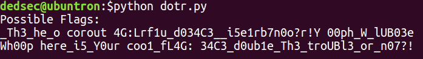

# dotr - mid

<b>I implemented some [crypto](./dotr.py) and encrypted my secret: `03_duCbr5e_i_rY_or cou14:L4G f313_Th_etrph00 Wh03UBl_oo?n07!_e`

Can you get it back? </b>

## Solution

<b>Script: [dotrSolve.py](./dotrSolve.py)</b>

<b>TL;DR Bruteforce the key!</b>

Looking at the encryption we realize that a key consisting of 16 numbers is randomly generated and the first 8 numbers are zipped with numbers from 0 to 7. This zip object is then sorted according to the 1st element in the pair and then **the 2nd elements are used as starting indices to form 8 groups, each containing letters from the message at a distance of 8 from each other starting at the index given by the 2nd element**. These groups are then concatenated and returned as the ciphertext.

So the encryption is simply a rearrangement of the message according to a key given by a random permutation of the numbers 0-7, applied twice that too with the same key!

Bruteforcing the key isn't hard as the number of ways to permut 8 numbers is `8!` which is only `40320`.

Therefore, generate all possible permutations of numbers from 0 to 7 and feed each one as the key to the decryption function twice and check if the final output contains `34C3_`.

Here's a snippet for splitting the ciphertext into groups for a given key:

```
groups = []
i = 0
for k in range(8):
    grp = []
    tmp = 0
    if key[k] < len(ctxt)%8: tmp = 1
    for j in range(int(len(ctxt)/8) + tmp):
        grp += [ctxt[i+j]]
    groups += [grp]
    i += j+1
```

Once you formed the groups, the original message can be constructed with the following code:

```
m = ['*']*len(ctxt)
for k in range(8):
    i = 0
    for j in range(key[k], len(ctxt), 8):
        m[j] = groups[k][i]
        i += 1

message = ''.join(m)
```

I ran my script and within a second it showed only two possibilities; out of which one is the flag: `34C3_d0ub1e_Th3_troUBl3_or_n07?!`


