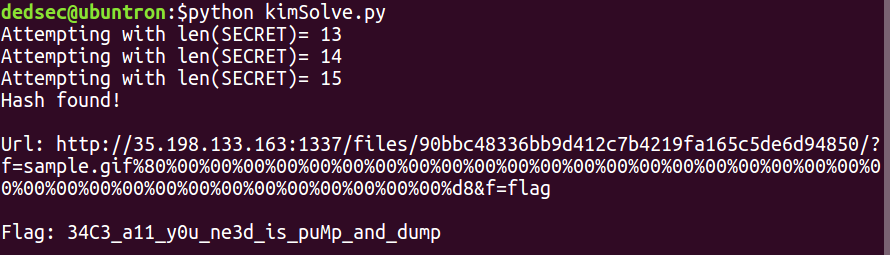

# kim - easy

<b>Check [this](http://35.198.133.163:1337/) out!!!!!!!!!!!\x80\x00....

Update: [Source](./kim.py)
 </b>

## Solution

<b>Script: [kimSolve.py](./kimSolve.py)</b>

<b>TL;DR Perform a hash length extension attack on sha1</b>

The question requires us to send a query containing the parameter `'f=flag.png'` to the url given by the sha1 hash of the query itself. Problem is that the sha1 hash is salted and we don't know the salt. However, we are provided with a sample query (f=sample.gif) and its salted hash(952bb2a215b032abe27d24296be099dc3334755c).

#### About the Attack
For performing a hash length extension attack, we require a string (say `query`) and it's corresponding salted hash (say `saltedHash`). Then, supposing we only know the length of the salt (say `saltLen`),  it is possible to construct another `newSaltedHash` and its corresponding string `newQuery` which starts with the contents of `query` and ends with a string of our choice (say `newKeyValue`).

In other words: `newQuery, newSaltedHash = hashLengthExtensionAttack(newKeyValue, query, saltLen, saltedHash)`

#### Performing the Attack
In this case, we can construct a query such that it begins with `?f=sample.gif` and ends with `f=flag`, something like `?f=sample.gif&XXXXXXXXXXX&f=flag`.
Such a query would give preference to the latter value assigning the value `flag` to the key `f`. So we have the following: 
```
query = 'f=sample.gif'
saltedHash = '952bb2a215b032abe27d24296be099dc3334755c'
newKeyValue = 'f=flag'
```

[This](https://github.com/stephenbradshaw/hlextend) is a useful tool I found to perform the necessary attack. We do not know the length of the salt but it can be bruteforced easily. I wrote a script to do exactly this with the help of the hlextend module. After running the script, for salt length = 15, we get the flag: `34C3_a11_y0u_ne3d_is_puMp_and_dump`


