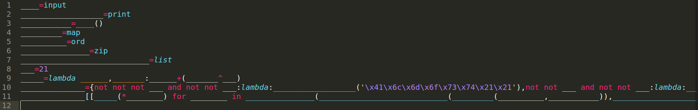
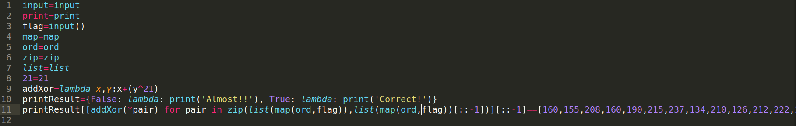
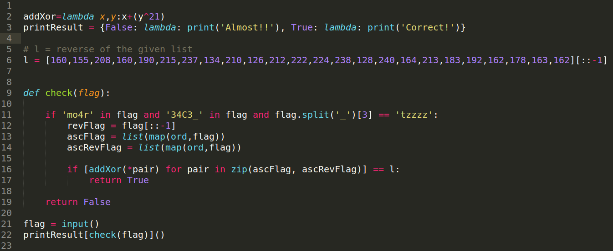

# nohtyp - easy

<b>We love [snakes](./nohtyp.py). </b>

Hints:
```
    $ cat flag | md5sum

    5a76c600c2ca0f179b643a4fcd4bc7ac
```

## Solution

<b>Script: [solve.py](./solve.py)</b>

The question looks very daunting with everything written in a single line and variable names consisting of only underscores.
So let's edit it first by splitting it into multiple lines.

#Edit 1


Now let's give the variables some meaningful names and convert the hex values to normal characters.

#Edit 2


After reorganizing the code and cleaning it up a bit, we get the following:


The script is accepting user input as the flag and checking if it contains these strings:
1)`34C3_`

2)`mo4r`

3)`tzzzz`

Moreover the `split('_')[3]` implies there must be 3 underscores. Along with all these checks, the script is performing the `addXor()` function on the flag and its reverse and checking if these values are equal to the reverse of a list of numbers.

Now we can check the strings (1), (2), (3) stated above at each position and perform the reverse of the `addXor()` function by using the corresponding values from the given list and deduce the flag step by step.

Following these steps, we'll end up with something like `34C3_mo4r_****4kes_tzzzz`. We can simply bruteforce the remaining 4 characters and check if the flag's md5 matches with the `5a76c600c2ca0f179b643a4fcd4bc7ac`.

The bruteforce and md5 check might require a script, but the previous steps can be done manually. However I automated everything in the script and here's the flag it gave: `34C3_mo4r_schn4kes_tzzzz`

