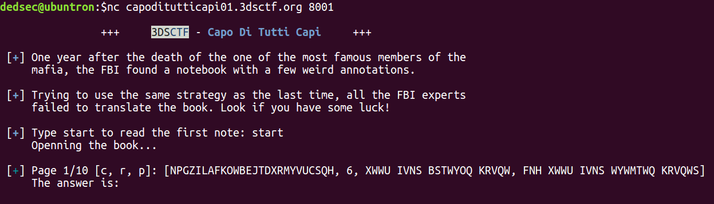
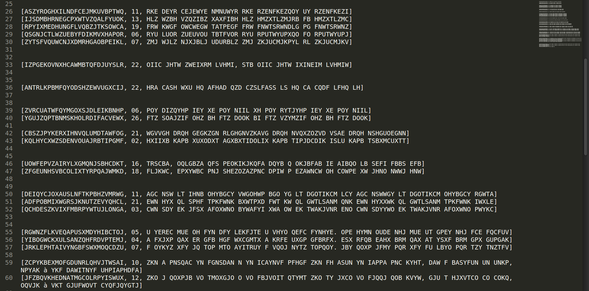
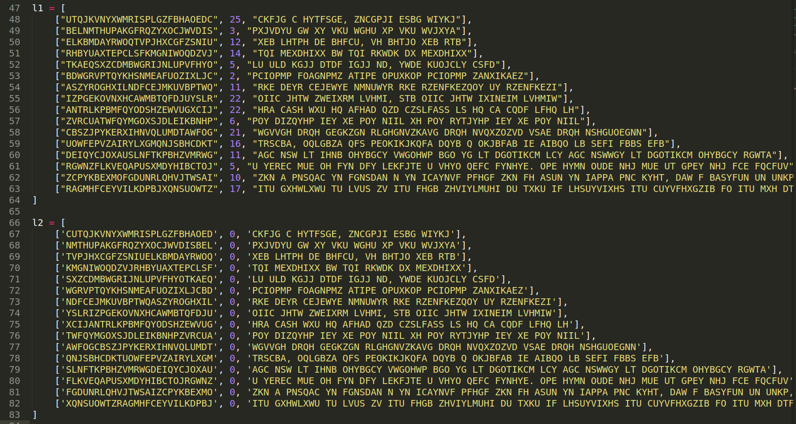
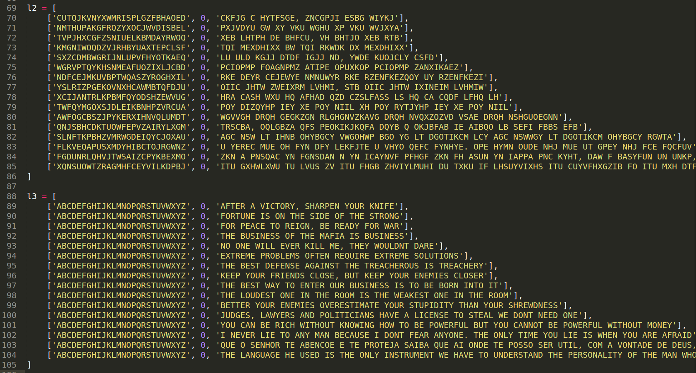
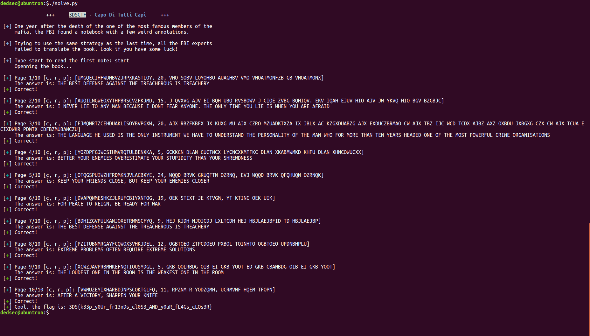

# Capo Di Tutti Capi - 456 Points

## Question:
 
### Help the FBI

<b> Server: capoditutticapi01.3dsctf.org

Port: 8001 </b>

## Solution:

<b>Script: [solve.py](./solve.py)</b>

<b>TL;DR Apply the Caesar shift on c using r and then Substitution Cipher on both c and p!</b>

As soon as you connect and type "start" you're given a tuple [c, r, t] something like this:

Hmm, the "c" looks like the set of alphabet scrambled, there's a number "r" and the "t" looks like the actual ciphertext we're supposed to decipher.

Something says the "r" is probably the "rotation" that needs to be applied over the characters but let's not jump to conclusions.

I wrote a script for fetching a bunch of these strings as each time it gave a different one and grouped some strings together as they looked like the encryption of the same message with different (c, r). This is what I got:

If you analyze the relation between "r" and the letters between ciphers of the same message, you'll notice it just seems to be a shift over the alphabet "c". So we're right, the "r" indeed stands for rotation!

Let's make this variable 0 and shift the "c" corresponding to the shift number (apply ROT(c, -r)).

Now we're just left with the "c" and "p". I couldn't think of anything else other than simply replacing every corresponding alphabet in "c" with it's corresponding letter in the alphabet according to it's position. Let's do it and see what we get.

Voila! The message got decrypted!

We're not given much time in the question to do this manually, so I wrote a script to automate it and sure enough, after Page 10/10 we're greeted with the flag:

`3DS{k33p_y0Ur_fr13nDs_cl0S3_AND_y0uR_fL4Gs_cLOs3R}`

Here's what the script yielded:

