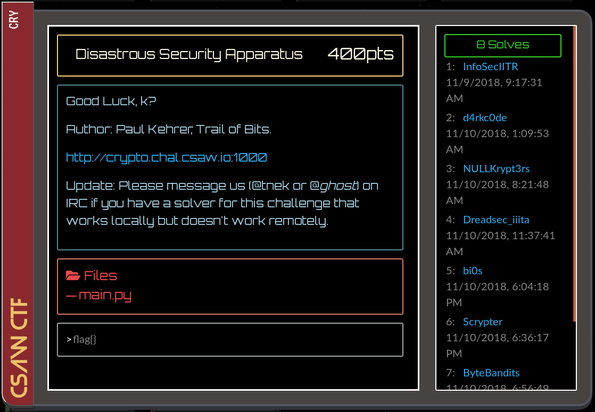
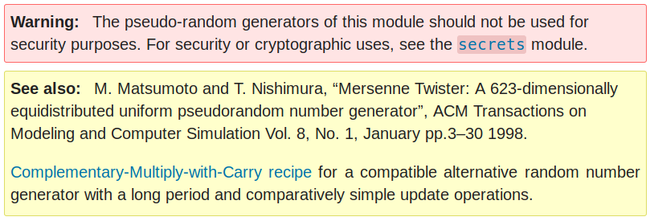

# Disastrous Security Apparatus - 400pts

Here's the challenge task from the crypto category:



<b>
Good Luck, k?

Author: Paul Kehrer, Trail of Bits.

[http://crypto.chal.csaw.io:1000](http://crypto.chal.csaw.io:1000)

Update: Please message us (@tnek or @ghost) on IRC if you have a solver for this challenge that works locally but doesn't work remotely.

Files: [main.py](./main.py)

 </b>

## The Overview

The title of the challenge hints us that this question is about DSA or Digital Signature Algorithm.
DSA is a public-key cryptosystem where the messages are signed by the signer's private key (`x`) and the signatures are verified by the signer's corresponding public key (`y`).
Downloading the given source code, we realize it is a simple Flask application with 7 routes defined:

- `/`

    The index page greeting us

- `/public_key`

    Displays the DSA public key of the server listing `p`, `q`, `g` and `y`

- `/challenge`

    Displays the Fernet encrypted ciphertext of the word `challenged!`

- `/sign/<data>`

    Signs the given `data` with the private key on the server using the SHA1 hashing algorithm

- `/capture`

    This endpoint only accepts POST requests with `challenge` and `signature` as inputs. It first Fernet decrypts the ciphertext given in `challenge` and then verifies its signature against the given one using SHA256 hashing algorithm.

    If there's no error in the above steps, the flag is displayed to us!

- `/forgotpass`

    Displays a url with a random 64-bit number at the end

- `/resetpass/<key>`

    Hasn't been implemented yet

It's clear that we'll get the flag only if we can produce a valid signature of any data signed using SHA-2. Unfortunately we only know the signature signed using SHA-1 obtained via `/challenge`. We somehow need to forge a valid signature and get the flag.

I immediately downloaded the code and set up a local server for faster responses and easy debugging. I went through the code once and noticed some endpoints were unnecessary like `/`, `/resetpass`, and `/forgotpass` because there was no `login` system right, why do we need these features? To simplify the challenge, I removed these but put them at the back of my head (which turns out to be useful later!).

My friend and I tried doing the math to somehow manipulate the equations used for signing and verifying and create a fake signature but it basically boiled down to bruteforcing the private key `x` which isn't feasible. I went to the Wikipedia page for [Digital Signature Algorithm](https://en.wikipedia.org/wiki/Digital_Signature_Algorithm) and read that the random value `k` used in generating the signature is very critical to the signing algorithm.

Apparently the ECDSA private key used by Sony to sign software for the PlayStation 3 game console was easily recovered because they didn't use a new random key for each signature.

Cool! So maybe there's a way to predict the value of `k` during signing. The challenge uses python's random module to generate random numbers and visiting the docs of the module, I notice a warning:



That means the random module is breakable! Searching around for a bit, I realize the PRNG is based on [`Mersenne Twister`](https://en.wikipedia.org/wiki/Mersenne_Twister) which is a general-purpose PRNG and not exactly cryptographically secure. Then I come across this very useful repo on GitHub: [https://github.com/tna0y/Python-random-module-cracker](https://github.com/tna0y/Python-random-module-cracker).

It basically takes 612 32-bit random numbers and predicts the internal state matrix of the PRNG and outputs the most probable random numbers that might generate next. Ohh! So this is where the `/forgotpass` will be useful! The random value at the end of the resetpass link can be given as input to this script to predict the value of `k`!

## The Solution

**Script: [solve.py](solve.py)**

I cloned the repo, imported it into my script and coded up a scraper that feeds the random numbers from `/forgotpass` to the Cracker. But there was a slight problem. The Cracker is for 32-bit random numbers and the challenge deals only with 64-bit numbers. My friend and I searched for a bit and switched the Mersenne Twister coeffecients in `RandCrack` with their 64-bit counterparts but it didn't seem to work. Then I had the following hunch: *What if there's a relation between 2 consecutive 32-bit numbers and 1 64-bit number generated from the same seed?* I put this theory to test:

```py
>>> import random
>>> import time
>>> seed = time.time()
>>> random.seed(seed)
>>> r1 = random.getrandbits(32)
>>> r2 = random.getrandbits(32)
>>> random.seed(seed)
>>> n = random.getrandbits(64)
>>> n == (r1 << 32) + r2
False
>>> n == (r2 << 32) + r1
True
```

The second statement returned `True`! Great! So they are indeed related via bit-shift and addition! Now we can continue working on the Cracker and use this relation wherever needed. Here's the function which feeds the random numbers to the cracker and predicts `k`. It takes the an object of `RandCrack` and the Fernet ciphertext returned by `/challenge`:

```py
def get_numbers(cracker, data):
    l = [requests.get(base+'/forgotpass').text for _ in range(312)]
    d = eval(requests.get(base+'/sign/'+data).text)
    r, s = d['r'], d['s']    
    pk = eval(requests.get(base+'/public_key').text)
    
    for i in range(312):
        n = l[i].split('/')[-1]
        n = binascii.unhexlify(n)
        n = struct.unpack('>Q', n)[0]
        r1 = n & (0xffffffff)
        r2 = (n & (0xffffffff00000000)) >> 32
        assert (n == ((r2 << 32) + r1))
        cracker.submit(r1)
        cracker.submit(r2)
    k = cracker.predict_randrange(2, pk['q'])
    return pk, r, s, k
```

It returns the `public_key`, `r`, `s` and *hopefully* the correctly predicted `k`. Now we can do some math and get the private key `x` from this data. We know that:
```
s = kinv * (h + r * x) % q
s * k = (h + r * x) % q
(s * k) % q = (h + r * x) % q
(s * k - h) % q = (r * x) % q
((s * k - h) * rinv) % q = x % q
```
Hence, 
```
x = ((s * k - h) * rinv) % q
```

Here `kinv` and `rinv` are the modular inverses of `k` and `r` respectively wrt. `q`. We can verify this value of `x` by checking if `y == g ** x % q` or `y == pow(g, x, q)`. If it returns `True` then we've successfully extracted the private key and can now forge a valid signature for any data using any hash.

Let's use the same `r` and same `data` (the Fernet ciphertext) but let's sign it using SHA-256. We get the new value of `s` as:

`forge_s = kinv * (h2 + r * x) % q`

Here `h2` is the SHA-256 sum of `data` interpreted as an integer.
We can use the `encode_dss_signature()` function to encode `(r, forge_s)` into a signature and `POST` this value along with the `data` containing the corresponding Fernet ciphertext to the `/capture` endpoint and get the flag!

**`flag{NowyourereadytocrackthePS3YeahSonydidthiswithECDSA}`**

P.S.
- You can set-up the challenge on your `localhost` by generating your own DSA-key or by simply copying this [ctf.key](https://github.com/osirislab/CSAW-CTF-2018-Finals/blob/master/crypto/distastrous_security_apparatus/ctf.key) to your directory, setting the `CSAW_FLAG` environment variable and running [main.py](main.py)
- During the challenge, the solution worked on localhost but not remotely so when I contacted the admin as the Update suggested, they gave me a different url on which the script worked perfectly and we got the flag.
