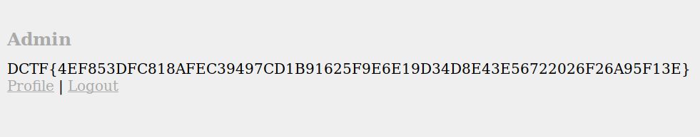

# Get Admin - 220

<b>
This is a very unexpected gig for me. However, I'm busy with other projects so can you please give me a hand to test this. For free, of course. :-)

Files: [https://dctf.def.camp/dctf-18-quals-81249812/get-admin.zip](https://dctf.def.camp/dctf-18-quals-81249812/get-admin.zip)

Target: [https://admin.dctfq18.def.camp/](https://admin.dctfq18.def.camp/)
</b>

## Solution

### Overview
The website is pretty basic, it lets you register an account with your name, password, email and lets you login. If your `id` is `1` (i.e. if you are `admin`), it prints the flag else says `Try Harder` (for all other users). There's an option to update your profile if needed and an option to logout.

When we login to the website, it sets a cookie in our browser which is `AES-128-CBC` encrypted and contains our `id` (automatically set at the time of registration), `username`and `email` along with the `CRC-32 checksum`. Along with this encrypted data, it contains a `length` in the end which gives the length of the decrypted plaintext cookie. Odd. This was an unnecessary piece of information for this encryption/decryption scheme. We'll see later how this was used to exploit the decryption.

### Encryption of the Cookie
Let's get to specifics. As soon as we login, the following cookie is set in `index.php`:
```php
setcookie('user',encryptCookie([
    'id' => $userid,
    'username' => $_POST['username'],
    'email' => $row['email'], 
]), time()+60*60*24*30);
```

Here's `encryptCookie()` function from `config.php` along with its helper functions:
```php
function encryptCookie($arr) {
    $cookie = compress($arr);
    $arr['checksum'] = crc32($cookie); 
    return encrypt(compress($arr), AES_KEY, AES_IV);
}

function compress($arr) {
    return implode('÷', array_map(function ($v, $k) { return $k.'¡'.$v; }, $arr, array_keys($arr) ));
}

function encrypt($plaintext, $key, $iv) {
    $length     = strlen($plaintext);
    $ciphertext = openssl_encrypt($plaintext, 'AES-128-CBC', $key, OPENSSL_RAW_DATA, $iv);
    return base64_encode($ciphertext) . sprintf('%06d', $length);
}
```

`compress()` simply serializes the array into a string where key-value pairs are separated by a `÷` and inserts `¡` between each key and value. For example if `id = 1337, username = testac, email = fake@mail.com` then `compress()` returns `id¡1337÷username¡testac÷email¡fake@mail.com`.

`encryptCookie()` takes `id`, `username` and `email` as inputs, calculates the `CRC-32` checksum of the serialized cookie, appends it to the cookie again. Now we get: `id¡1337÷username¡testac÷email¡fake@mail.com÷checksum¡2160329226`

This string is then encrypted with `AES-128-CBC` and the length of the above string `70` (`¡` and `÷` are counted as length `2` each) padded with `0s` is appended to the resulting `base64` string. So this is our final cookie:
`Rx5R751nNLFTDmwdj248byPKYFCReDmb8cTlK8m53X3TLG5WpUwYv+8zN0Ur2YVZ0q7giK51kNvFRjr36elyKiunyw6aPYR1BAE9dF6+7KU=000070`

### Decryption of the Cookie

In `index.php`, if the cookie is already set but `_SESSION['userid']` is not, it tries to decrypt the cookie and if the `id` in it is greater than `0`, sets the `_SESSION['userid']` variable and redirects us to `admin.php`. Here's `decryptCookie()` and its helper function from `config.php`:
```php
function decryptCookie($cypher) { 
    return decompress(decrypt($cypher, AES_KEY, AES_IV));
}

function decrypt($ciphertext, $key, $iv) {
    $length     = intval(substr($ciphertext, -6, 6));
    $ciphertext = substr($ciphertext, 0,-6);
    $output     = openssl_decrypt(base64_decode($ciphertext), 'AES-128-CBC', $key, OPENSSL_RAW_DATA, $iv);
    if($output == FALSE) {
        echo('Decryption error (0).');
        die();
    }
    return substr($output, 0, $length);
}
```

`decryptCookie()` takes the encrypted cookie, separates the `length` from the ciphertext, decrypts the cipher and returns only the first `length` characters of the decrypted cookie. Mhmm. This is then passed to `decompressed()`:

```php
function decompress($cookie) {
    if(preg_match('/[^\x00-\x7F]+\ *(?:[^\x00-\x7F]| )*/im',$cookie, $m) == 0) {
        echo('Decryption error (1).');
        return false;
    }

    $t = explode("÷", $cookie);

    $arr = [];
    foreach($t as $el) { 
        $el = explode("¡", $el); 
        $arr[$el[0]] = $el[1];
    } 

    if(!isset($arr['checksum'])) {
        echo('Decryption error (2).');
        return false;
    }

    $checksum = intval($arr['checksum']);
    unset($arr['checksum']);
    $cookie = compress($arr);
    if($checksum != crc32($cookie)) {
        echo('Decryption error (3).');
        return false;
    } 

    return $arr;
}
```

The `decrypt()` function:
- Checks if the decrypted cookie matches the regex
- Constructs the array from its serialized form
- Extracts the expected CRC-32 checksum
- Computes the CRC-32 checksum of the remaining data
- Checks if the two checksums match
- Returns the array containing the user data

This is then given back to `index.php` and it then redirects us to `admin.php`. There, if our `id == 1`, the flag is printed but as we are regular users, our `id > 1`.

### The Vulnerability

During registration, the website put no restrictions on the characters entered in the `email` field. Think what happens if I put my email as `fake@mail.com÷id¡1`.
My cookie would then be: `id¡1337÷username¡testac÷email¡fake@mail.com÷id¡1` along with its checksum. While decryption, due to the way `decompress()` is constructing the array, the array would be `id¡1÷username¡testac÷email¡fake@mail.com` as the latter `id` replaces the value of the former one. This is exactly what we want!

But unfortunately the `CRC-32` checksum fails as the expected checksum (`checksum=732808468`) would be of the original data with 2 `id`s whereas the resulting one (`checksum=3870551952`) is of the data with only 1 `id`. Let's inject the checksum too then!

Modifying our email to include the checksum of the data with `id=1`, our new cookie will be: `id¡1337÷username¡testac÷email¡fake@mail.com÷id¡1÷checksum¡3870551952`

This will then be appended with its checksum giving: `id¡1337÷username¡testac÷email¡fake@mail.com÷id¡1÷checksum¡3870551952÷checksum¡2104704402`

But now, our checksum gets overwritten by the new one just like we overwrote the previous value of `id`. This is where the `length` comes into picture! If we reduce the `length` only upto the first checksum (i.e. the first `77` characters), the `decompress()` function thinks that's the original checksum and decrypts the cookie without any errors!

That is all we need to do to get `ADMIN ACCESS`!

1. Register with the following details:
    - username: `testac`
    - email: `fake@mail.com÷id¡1÷checksum¡3870551952`
2. Login and get your cookie (will result in `Decryption Error (3)`)
3. Logout, change the length in the cookie to `000077` and set the cookie
4. Navigate to admin.php

And we have the flag!



**`DCTF{4EF853DFC818AFEC39497CD1B91625F9E6E19D34D8E43E56722026F26A95F13E} `**
