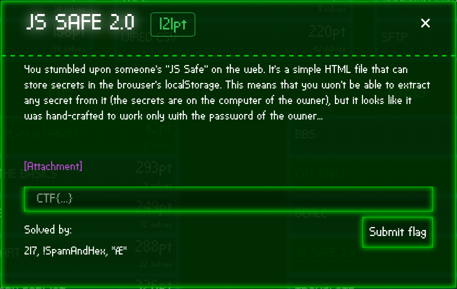
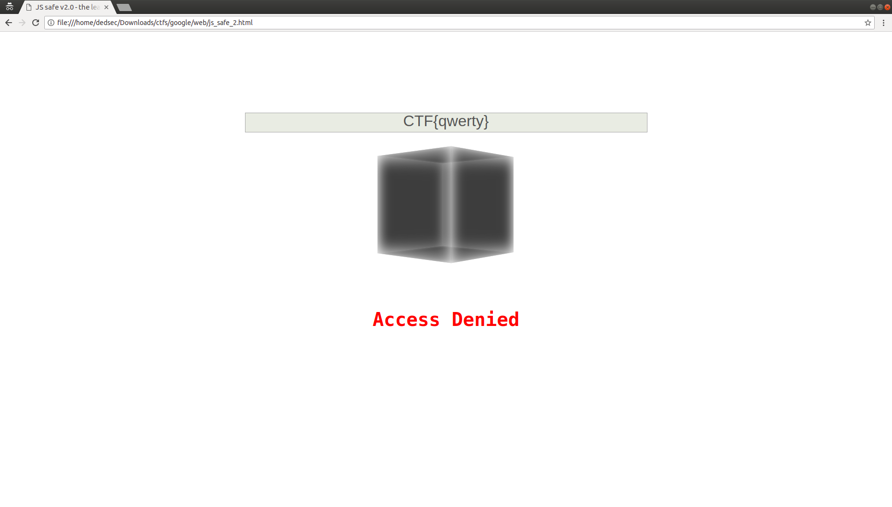
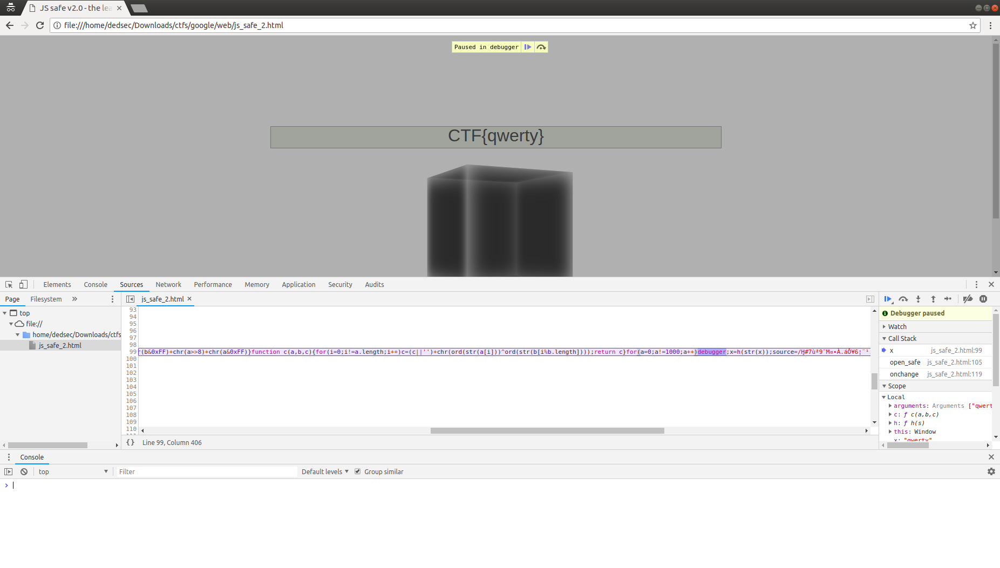
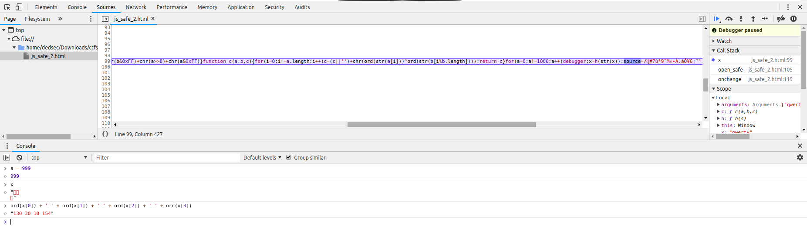
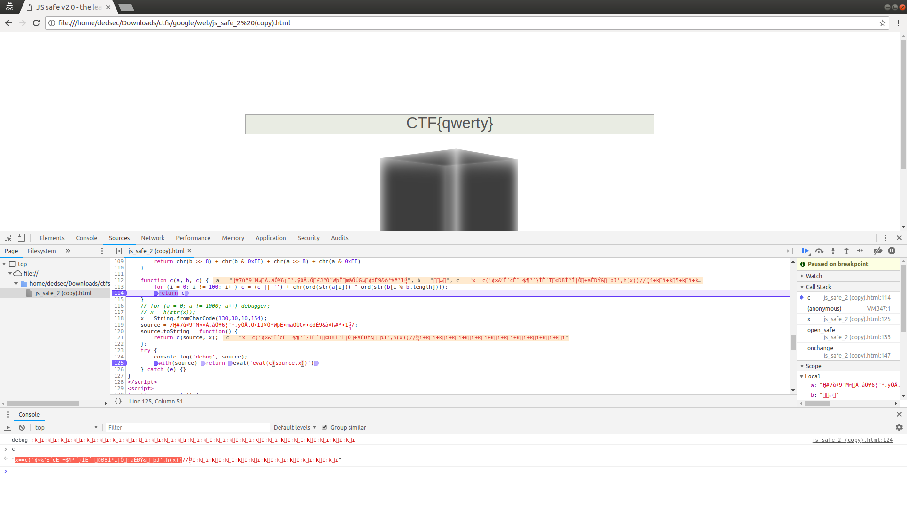
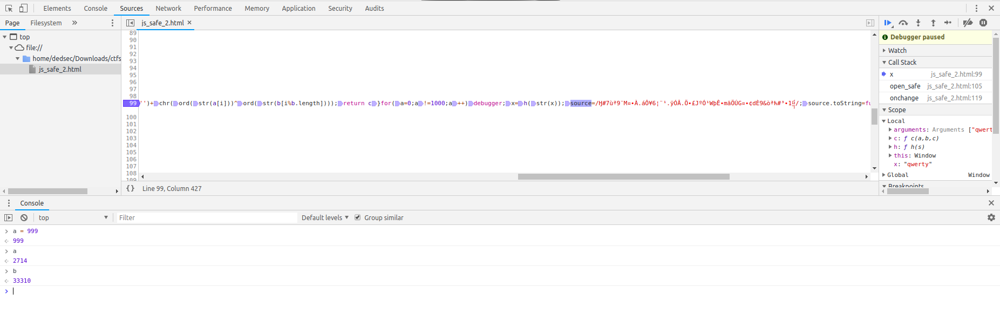
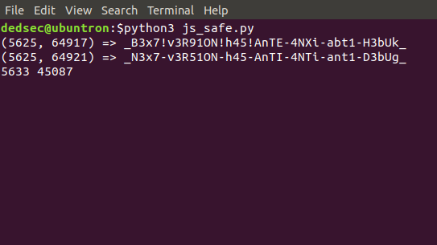
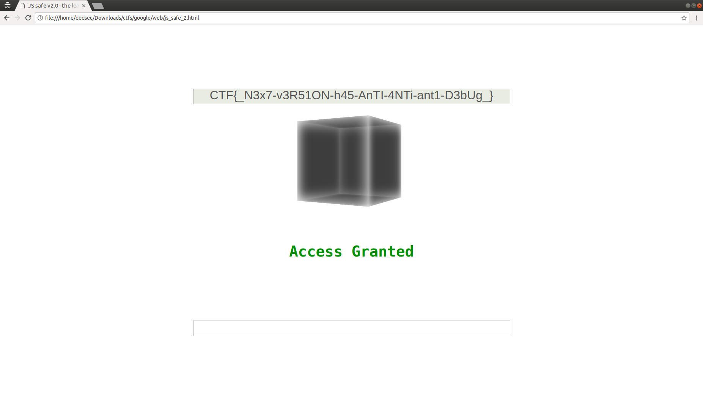

# JS Safe 2.0 - 200

Here's the challenge task from the web category:



<b>You stumbled upon someone's "JS Safe" on the web. It's a simple HTML file that can store secrets in the browser's localStorage. This means that you won't be able to extract any secret from it (the secrets are on the computer of the owner), but it looks like it was hand-crafted to work only with the password of the owner...

[js_safe_2.html](./js_safe_2.html)

 </b>

## The Overview

Downloading the html file and viewing it locally gives us a cool looking cube (intended to be the JS Safe I presume) and an input box for the password. 



Whenever you type the password and hit enter (return), the `open_safe()` function gets triggered.

```js
password = /^CTF{([0-9a-zA-Z_@!?-]+)}$/.exec(keyhole.value);
if (!password || !x(password[1])) return document.body.className = 'denied';
```

The above two statements from `open_safe()` suggest the password consists of alphanumeric characters and a few other symbols and must be enclosed by `CTF{}`. That's the first condition in the `if` statement. The second condition takes us to the function `x()`. After using a JS Beautifier, here's the function:
```js
function x(х) {
    ord = Function.prototype.call.bind(''.charCodeAt);
    chr = String.fromCharCode;
    str = String;

    function h(s) {
        for (i = 0; i != s.length; i++) {
            a = ((typeof a == 'undefined' ? 1 : a) + ord(str(s[i]))) % 65521;
            b = ((typeof b == 'undefined' ? 0 : b) + a) % 65521
        }
        return chr(b >> 8) + chr(b & 0xFF) + chr(a >> 8) + chr(a & 0xFF)
    }

    function c(a, b, c) {
        for (i = 0; i != a.length; i++) c = (c || '') + chr(ord(str(a[i])) ^ ord(str(b[i % b.length])));
        return c
    }
    for (a = 0; a != 1000; a++) debugger;
    x = h(str(x));
    source = /Ӈ#7ùª9¨M¤ŸÀ.áÔ¥6¦¨¹.ÿÓÂ.։£JºÓ¹WþʖmãÖÚG¤…¢dÈ9&òªћ#³­1᧨/;
    source.toString = function() {
        return c(source, x)
    };
    try {
        console.log('debug', source);
        with(source) return eval('eval(c(source,x))')
    } catch (e) {}
}
```

Notice how both, the name of the function and the parameter it takes, both, *look* like `x`. Sublime/VSCode actually helped me here to realize that the parameter `х` isn't the `x` from our alphabet. Instead, it is a [Cyrillic](https://en.wiktionary.org/wiki/%D1%85) alphabet which only looks like it. For now let's just keep in mind that we're dealing with two different `x`'s here.

The next three lines are just defining the usual `ord`, `chr` and `str` functions. The function `h()` seems to some sort of a hashing algorithm which returns 4 characters no matter the size of the input.

Next is the function `c()` which is essentially taking a string `a`, a key `b`, performing a repeated xor on the two and returning the resulting string.

Then is the `for` loop with the `debugger` statements which we can can ignore for now.

Then comes the statement `x = h(str(x))`. Here the `x` is the entire function itself in its raw (unmodified) form which is given to `h()` as a string and the resulting string (which has a length of 4) is being stored in `x` again.
We need the original value of `x` as we modified the code (by prettifying it). Let's run the original html file again with debugging enabled.

## The Solution

Open up developer tools in the browser and enter any password of the format we extracted above (like `CTF{qwerty}`).



The code immediately gets paused in the debugger because... remember the `1000` iterations `for` loop with the debugger statements we ignored? Luckily, we can open up the console and skip all those iterations by directly modifying the loop variable and assigning `a = 999`. Stepping over a few times, we get the correct value of new `x` to be a bunch of characters with ascii values `130 30 10 154`.



Now that we got the correct values, we can overwrite our `x` in the prettified code with these.

```js
// x = h(str(x));
x = String.fromCharCode(130,30,10,154);
```

Next we have a regular expression being assigned to a variable `storage` and then since a regex is not a string, they wrote their own implementation of the `toString` function.

In the `try` block, it is printing out the `source` onto the console and with `source` as the scope, executing `eval('eval(c(source,x))')`.

Remember the weird `х` which was our input? I was kinda surprised the code never really used this input anywhere. Anyway, let's not jump to conclusions and see what the last line does. (Cuz this is where all the magic happens :wink:)

Set a breakpoint at the `eval` statement and run the code with the input `CTF{qwerty}`. 
To my horror my browser just hanged. It didn't even hit the breakpoint we set. Weird. We know it executed successfully till the `source` variable was assigned. Maybe the `toString` is messing up? And we are right, it calls `c(source, x)` which performs a repeated xor on `source` with `x` (it's the 4 chars string) as the key. It is supposed to happen for `a.length` iterations but wait! Here, `a` is `source` which is a regex and a regular expression does not have a length property! So the loop just iterates infinitely and that explains why the browser *hanged*.

Let's manually put a limit to it and see what the result looks like.
Modify the `for` loop conditions to `(i = 0; i != 100; i++)` and run the code again. This time, we hit the breakpoint. Now set a new breakpoint in `c()` at the `return c` statement because we want to see the output of the first `eval`. After setting, continue and we'll hit the breakpoint at return.



Interesting, it is returning the following expression 

```js
х==c('¢×&Ê´cʯ¬$¶³´}ÍÈ´T—©Ð8ͳÍ|Ԝ÷aÈÐÝ&›¨þJ',h(х))//᧢ï÷kï÷kï÷kï÷kï÷kï÷kï÷kï÷kï÷kï÷kï÷kï`
```

Out of curiosity I checked which `х` this is and sure enough, this is where our input was being used!
Since this expression is being evaluated and returned to the `open_safe()` function, we need to somehow make it evaluate to `true`. Also our limit to the `for` loop is justified by the unnecessary comment in the end.

So we need to find an input (instead of `qwerty`), that when hashed by `h()` and given as a key to `c()` along with the string containing the strange characters we got above, yields the input itself. One thing to note is that `c(a, b)` returns a string of length equal to that of `a`. So in this case, our input (the Cyrillic `х`) must be a string of length `39`. because the weird string '`¢×&Ê´cʯ¬$¶³´}ÍÈ´T—©Ð8ͳÍ|Ԝ÷aÈÐÝ&›¨þJ`' is of that length.

Definitely not something we can brute force. At this point I couldn't think of anything else but try to understand how the function `h()` works. So here it is:

```js
function h(s) {
    for (i = 0; i != s.length; i++) {
        a = ((typeof a == 'undefined' ? 1 : a) + ord(str(s[i]))) % 65521;
        b = ((typeof b == 'undefined' ? 0 : b) + a) % 65521;
    }
    return chr(b >> 8) + chr(b & 0xFF) + chr(a >> 8) + chr(a & 0xFF);
}
```

The variable `a` seems to be simply the sum of the ascii values in the string mod `65521`. And the variable `b` seems to be similar but each value gets a weightage when you do the math. The initial values seem to be `1` and `0` respectively but that is only when `h()` is called the first time. Remember `x = h(str(x))`? That was the first time when it was called and towards the end of the loop, it had values `a = 2714` and `b = 33310` (run the original source again and step over till this statement).



Finally, 4 characters are being concatenated and returned which are generated from these two numbers only. 
Then it struck me! We cannot possibly brute force the input but we can definitely brute force `a` and `b` which would yield all possible keys and we can pick the one which produces a valid english plaintext when passed through `c()`. Also, we need to make sure the resulting text produces the same values of `a` and `b` when passed through `h()`.
I thought about the range of `a` and `b`, its `0 to 65521` and if my hunch is right, the `a` we are looking for must be in the range `2714 to 65521` and `b` in the range `33310 to 65521` *(because those were the initial values of `a` and `b` when `h()` was being called the second time)*.

I quickly scripted this in python and wrote my own version of `c()` to know quickly if it generates a valid english alphabet result for a given `a` and `b`.
```py
chars = string.ascii_uppercase + string.ascii_lowercase + string.digits + '_@!?-'

def fast_c(a, b):
	for i in range(len(a)):
		xor = chr(ord(str(a[i])) ^ ord(str(b[i % len(b)])))
		if not (xor in chars):
			return False
	return True
```

```py
weird = u'¢×&Ê´cʯ¬$¶³´}ÍÈ´T—©Ð8ͳÍ|Ԝ÷aÈÐÝ&›¨þJ'
n = 65521

for a in range(2714, n, 1):
	for b in range(33310, n, 1):
		sys.stdout.write('%d %d \r' % (a, b))
		key = chr(b >> 8) + chr(b & 0xFF) + chr(a >> 8) + chr(a & 0xFF)
		if fast_c(weird, key):
			inp = c(weird, key)
			print('(%d, %d) => %s' % (a, b, inp))
```

After a while, we get the flag we are looking for! The first string doesn't make complete sense but the second one does!



Just to be sure, I entered it as the password and voila!



`CTF{_N3x7-v3R51ON-h45-AnTI-4NTi-ant1-D3bUg_}`

At this point I was just admiring the beauty of this challenge. Create a hash of its own source code and use it as the key? Dynamically generate code during runtime and evaluate the input? Awesome! This was my first time debugging a JS web challenge and it was fun!

Cheers to the CTF organizers at Google! :tada:
