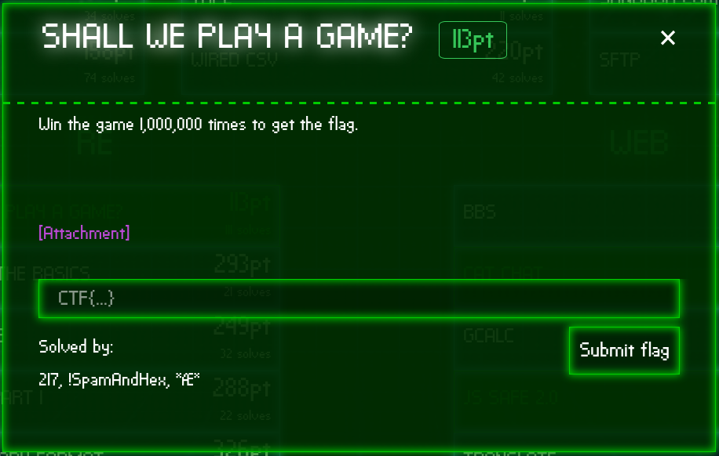

# Shall We Play a Game? - 113

## The Challenge
Here's the challenge task from the reversing category:



<b>

[app.apk](./app.apk)

 </b>

## Introduction

Just a heads up, I am completely new to reversing and especially apk rev. So I initially avoided this challenge but later decided to hit it as it seemed to be the easiest challenge the CTF.

As I said, this was my first apk rev challenge. The apk won't even run on my phone so I had to try on other phones to see what it is about. Now based on what I found, the basic approach to reversing an apk goes like this:

* To understand the apk
    1. Convert the apk to a jar file
    2. Decompile the jar to extract the java class files
    3. Get a rough idea of the working of the apk from these source files
* To modify the apk
    1. Decompile the apk again but this time to extract .smali files
    2. Modify the .smali files
    3. Build the apk
    4. Sign the apk and deploy it

I converted the apk to a jar using `dex2jar` and then decompiled the jar using online decompilers.
The modification of the apk can be done using `apktool`
and you can sign it using `jarsigner`.

## The Overview

On installing and running the app, we get the famous tic-tac-toe game (also called Noughts and Crosses). When you win/tie against the CPU, it resets the board and displays `1/1000000`. Meaning we have to play a million games to get the flag just like the challenge said.


Playing the game a million times is clearly absurd and we have to trick the app into thinking we played those many times.

I jumped into the source code of the app given in `GameActivity.java` that we get after decompiling the jar. I search for `1000000` and find it in this function called `n()`.

```java
  void n()
  {
    int i = 0;
    while (i < 3)
    {
      int j = 0;
      while (j < 3)
      {
        l[j][i].a(a.a.a, 25);
        j += 1;
      }
      i += 1;
    }
    k();
    o += 1;
    Object localObject = N._(new Object[] { Integer.valueOf(2), N.e, Integer.valueOf(2) });
    N._(new Object[] { Integer.valueOf(2), N.f, localObject, q });
    q = ((byte[])N._(new Object[] { Integer.valueOf(2), N.g, localObject }));
    if (o == 1000000)
    {
      m();
      return;
    }
    ((TextView)findViewById(2131165269)).setText(String.format("%d / %d", new Object[] { Integer.valueOf(o), Integer.valueOf(1000000) }));
  }
```

There are 2 occurrences of the number. The first, in an `if` which evaluates to `true` only if `o` equals `1000000` meaning the `o` must be the counter as to how many games we won. And the second occurrence is in the text that displays our progress when we win a game.

This means that the method `n()` is being called every time we win a game. Since it was an 'easy' challenge I assumed maybe changing the one million to just ten or one would give us our flag; or maybe find where the variable `o` is being initialized and give it a an initial value of `999999` so we can directly get to `1000000`. Or better yet, directly call the flag printing method `m()`.

Unfortunately it's not *that* easy. It printed gibberish.


We can conclude one thing from this. The flag seems to be decrypted bit by bit after every winning game and we can't skip any games. We have to *'play'* **exactly** a million times to get the flag. Let's go ahead and change the definition of *'play'* then :wink:.

## The Solution

We know that `n()` is being called every time we win so the decryption part must be here. Neither the two `while` loops, nor the call to `k()` (which I think is for the animation at the end) look interesting but the following lines definitely look suspicious.

```java
Object localObject = N._(new Object[] { Integer.valueOf(2), N.e, Integer.valueOf(2) });
N._(new Object[] { Integer.valueOf(2), N.f, localObject, q });
q = ((byte[])N._(new Object[] { Integer.valueOf(2), N.g, localObject }));
```

These lines must be decrypting the flag after every game. Only if we can find a way to put it in a loop. That way we only need to win a few times to get the flag.

Basically, my idea was to modify the code to something like this:

```java
void n() {
    ... // The animations code

    while (true) {
        o += 1;
        Object localObject = N._(new Object[] { Integer.valueOf(2), N.e, Integer.valueOf(2) });
        N._(new Object[] { Integer.valueOf(2), N.f, localObject, q });
        q = ((byte[])N._(new Object[] { Integer.valueOf(2), N.g, localObject }));
        if (o == 1000000)
        {
            m();
            return;
        }
    }

    ... // The progress display code
}
```

I looked at its corresponding smali code in the `GameActivity.smali` file. It was kinda scary but eventually found my way to the method `n()` and the code we need to put in the loop. 


I realized loops are implemented with simple `goto` statements like in assembly. So I inserted a  `:goto_6` in the beginning and modified `if-ne v0, v9, :cond_2` to `if-ne v0, v9, :goto_6` so that the loop continues if `o` is not equal to a `million`.

I rebuilt the apk, signed it and installed it on my phone. As soon as I played the winning move of the first game, the game seemed to have hanged but after waiting patiently for a minute or two, we get the flag!


### **`CTF{ThLssOfInncncIsThPrcOfAppls}`**

---

## Extras

It was a fun challenge for me and here are some minor tweaks I came across while solving the challenge:

* ### Fixing the hang
    We can remove the *hang* by replacing the `while` loop with a `for` and constraining it to a limited number of iterations after every winning game. This can be done with the following smali code:

    ```python

    const v5, 0xffff            # Max iterations
    const v4, 0x0               # Loop counter
    :goto_6
    if-ge v4, v5, :cond_2       # Break out of the loop
    ...
    ...
    add-int/lit8 v4, v4, 0x1    # Increment counter
    goto :goto_6
    ```

* ### CPU plays X too
    While solving the challenge initially, I wanted to speed up the gameplay. So I thought of changing the CPU's choice to `X` too so that we can never lose. This logic was implemented in the `onClick()` method.
    ```java
    public void onClick(View paramView) {
        if (p) {}
        while (!m.isEmpty()) {
            return;
        }
        paramView = (a)paramView;
        if (!paramView.a()) {
            b.b();
            return;
        }
        b.a();
        paramView.setValue(a.a.b);
        if (a(a.a.b)) {
            n();
            return;
        }
        paramView = l();
        if (paramView.isEmpty()) {
            n();
            return;
        }
        a(paramView).setValue(a.a.c);
        if (a(a.a.c)) {
            o();
            return;
        }
        k();
    }
    ```

    When I changed all occurrences of `(a.a.c)` to `(a.a.b)` like in the `a(paramView).setValue()` line, the CPU started playing `X` too! (Don't forget to replace the call to `o()` with `n()` cuz you wanna win when the CPU wins too!)

    Here's a screenshot of the modded apk where CPU plays X and you have to fill the board to win!

    

* ### One move to win
    Wouldn't it be a lot better if you only need to tap once to win the game instead of getting 3 continuously? That's what I thought and this is simple to do. Simply remove the `if(a(a.a.b))` condition and just call `n()` in the `onClick()` method.

    This definitely speeds up the game but the annoying animations were taking so long. So I sped up those too by navigating to the `n()` method in the smali file and changing the line inside the two `while` loops from `const/16 v5, 0x19` to `const/16 v5, 0x0`.

The modded apk can be found [here](modded.apk) in which the CPU plays X and you have to wait a few minutes for the flag to decrypt. Its corresponding smali can be found [here](Modded_GameActivity.smali).

