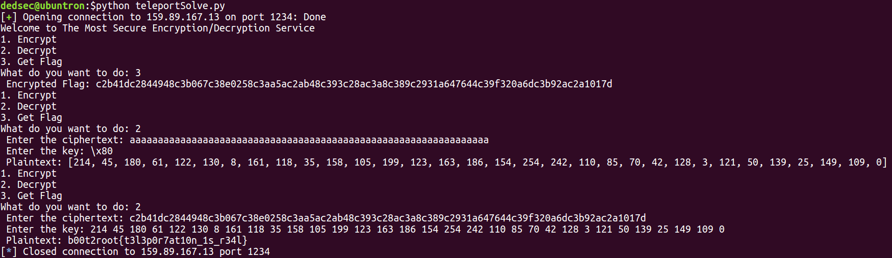

# Teleport - 200

<b>Here's a little fun exercise, see if you can find the flaw and pwn the service running at 159.89.167.13:1234

[teleport.py](./teleport.py)

Author: Dedsec
 </b>

## Solution

<b>Script: [teleportSolve.py](./teleportSolve.py)</b>

The service appears to be a simple encryption with xor using a randomly generated key consisting of random integers from 0 to 255. However the key is never being printed or stored anywhere and appears to be lost after the encryption (or is it?).

### The Exploit
For better understanding, consider the following snippet in python:
```py
import numpy as np

def send_data(x):
    # Initializing a numpy array
    np.array([int(x)])

def receive_data():
    # Return an empty numpy array
    return np.empty((), dtype=np.int).tolist()
```

**Output**
```py
>>> send_data(42)
>>> receive_data()
42
```

Surprising, isn't it! How did the data teleport from one function to another without ever being returned anywhere or stored globally?! One would expect the array initialized in `send_data()` to be lost forever and an empty array containing garbage values to be returned by the `receive_data()`. Clearly that's not the case. So what gives?

What is happening is that **we initialized an array in `send_data()` but never returned it** from the function so python marks it free for reallocation. Then when we call the `receive_data()` it looks for the **next memory location which is free and returns it without initializing**. Coincidentally it happens to be the same one that just got freed thus returning the array initialized in `send_data()`!

### Solution
Now coming back to the question, we see that the `key` array used for encrypting the flag has been initialized in `encrypt()` but never returned. From the above example we know it isn't lost forever ;). Also we notice the `return np.empty((int(len(ctxt)/2)), dtype=np.int).tolist()` in `line 24`. So if we can somehow get to execute this line immedietly after encrypting the flag, we can recover the original key!

If we analyze the code, we'll realize this line will be executed only when an exception is raised in `line 14` at `inp = input('Enter the key: ').split(' ')`. By the usage of `input()` it is obvious the script is running in python3 so we can raise a `UnicodeDecodeError` by inputting a non-unicode character (like `\x80`). This will trigger the `except` block thus executing the required line and causing the original `key` array to be returned.

So we first execute `Get Flag` which returns a hex containing 64 characters implying the flag contains 32 characters *(as hex of 32 characters will have 64 characters)*. Then we execute `decrypt()` by inputting a dummy ciphertext of length 64. When it asks for the key, we input a non utf-8 character like `\x80` causing an exception thus making it return the `key`.
Now we simply execute the `decrypt()` function again and input the actual ciphertext and the original key obtained above to get the flag: **`b00t2root{t3l3p0r7at10n_1s_r34l}`**

*Note: You can't simply type `\x80` in the terminal as python would treat it as a string consisting of 4 characters*


